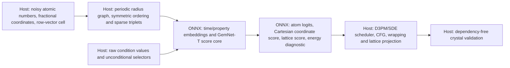

# MatterGen crystal diffusion score core

Mobius supports the deterministic neural score component from the official
[`microsoft/mattergen`](https://huggingface.co/microsoft/mattergen) release.
It is a periodic-crystal graph diffusion system, not a Transformers or
Diffusers model. The integration pins the Hub revision
`5244495dd9a979ff71abc7548a0b14b9deb0069a` and replicates the matching
MatterGen v1.0.3 source at
`842ffe735f7d06cec89d56aa23d9f001e1124b30`.



## ONNX score contract

The exported `model.onnx` consumes a host-normalized, dynamic periodic graph:

| Tensor | Type and shape | Meaning |
|---|---|---|
| `atomic_numbers` | `int64[N]` | MatterGen D3PM species IDs: `1..100`, with `101` as the absorbing mask. |
| `batch` | `int64[N]` | Crystal index for each atom. |
| `timestep` | `float32[B]` | Diffusion time for each crystal. |
| `edge_index` | `int64[2,E]` | Source-ordered periodic edges after MatterGen symmetric reordering. |
| `edge_distance` | `float32[E]` | Periodic Cartesian edge lengths. |
| `edge_direction` | `float32[E,3]` | MatterGen `V_st`: the **negative** normalized periodic distance vector. |
| `edge_lattice_cosines` | `float32[E,3]` | Host-computed `cosine_similarity(V_st, cell[batch[edge_index[0]]])`. |
| `id_swap`, `id3_ba`, `id3_ca`, `id3_ragged_idx` | `int64[...]` | Symmetric-edge and sparse-triplet indexes generated by the source ordering. |
| condition input(s) | family-specific | Raw chemical-system multihot, space-group, or scalar values plus explicit boolean unconditional selectors. |

It returns `atom_logits: float32[N,101]`, a Cartesian `coordinate_score:
float32[N,3]`, `lattice_score: float32[B,3,3]`, and an `energy:
float32[B,1]` diagnostic. The energy output keeps every trained GemNet
OutputBlock path observable; MatterGen's denoiser does not use it in its
sampling state update. The core intentionally does not mask atom logits,
convert Cartesian scores to fractional scores, wrap coordinates, or sample
atom types.

## Host orchestration and limits

MatterGen reconstructs its periodic radius graph on every score evaluation,
including data-dependent periodic image enumeration, nearest-neighbor
selection, symmetric edge reordering, and ragged triplets. Those operations
are not portable as a faithful dynamic ONNX contract. Mobius provides the
source-faithful CPU host implementation in
`mobius.integrations.mattergen.MatterGenHostSampler`; the application still
supplies the ONNX score callback. It has no MatterGen, PyTorch Geometric,
`torch_scatter`, or `torch_sparse` runtime dependency. In particular,
triplets exclude matching **edge IDs**, not matching atom IDs; valid periodic
self-image triplets remain possible.

The adapter owns all stochastic semantics: the fixed 1,000-step
absorbing-mask D3PM, wrapped VE coordinates, VP lattice updates,
predictor-corrector scheduling, classifier-free guidance, modulo-one
coordinate wrapping, lattice projection, and final structural validation.
It intentionally rejects a shortened/re-scheduled path rather than claiming
it is MatterGen. ONNX Runtime GenAI does not provide this runtime.

The `ModelPackage` remains a **partial score-core export**: its
`export_report.json` continues to mark periodic graph construction, sampling,
and crystal validation as deferred host stages with
`end_to_end_runnable: false`. `MatterGenHostSampler` is a separate,
application-composed CPU adapter around an explicit score callback; its
source-semantics and L5 test execute the real `mp_20_base` score artifact but
do not upgrade that partial package report.

```python
import onnxruntime as ort
import torch
from mobius.integrations.mattergen import (
    MatterGenHostSampler,
    create_onnxruntime_score_callback,
)

session = ort.InferenceSession("model.onnx", providers=["CPUExecutionProvider"])
sampler = MatterGenHostSampler(
    create_onnxruntime_score_callback(session),
    condition_names=(),  # Use the exported config's condition-input names when present.
)
samples = sampler.sample(torch.tensor([4, 8], dtype=torch.long), seed=1234)
crystals = samples.crystals()  # Dependency-free structural validation has run.
```

For a conditioned checkpoint, pass the exact raw ports declared by the
exported score graph, such as
`condition_values={"chemical_system": torch.from_numpy(...).reshape(B, 101)}`.
`chemical_system_multihot()` creates the one-based `[101]` value. The host
sets every `condition.<name>.use_unconditional` selector itself and performs
source classifier-free guidance in conditional-then-unconditional order. To
draw an unconditional sample from an adapter checkpoint, omit a condition
value; Mobius supplies a shape-valid internal placeholder and marks that
condition unconditional, matching the source's missing-property behavior.
The score callback receives `MatterGenScoreInputs`, including every graph
tensor, so a non-ORT inference host is equally supported.

`MatterGenCrystal` is a validated array artifact, not a replacement for
Pymatgen's optional `Structure`/CIF APIs. The default gate fails closed on a
non-finite or non-positive-volume cell, unwrapped coordinates, unsupported
species, or a count outside 1–20. Applications that require a Pymatgen
`Structure` or CIF must perform that optional serialization after validation;
Mobius does not add Pymatgen as a production dependency.

Official count priors support one through 20 atoms. Sampling must apply the
pinned 78-element allowlist (ending at Bi); it must not infer support from
the broader 101-class vocabulary. A chemical-system condition is a
101-element, one-based atomic-number multihot vector, where index zero is
unused. Scalar conditions use checkpoint-loaded standardization; `ml_bulk_modulus`
applies `log10` before standardization and must be strictly positive.

## Pinned-source evidence

The host adapter is a direct Torch port of these paths at source commit
`842ffe735f7d06cec89d56aa23d9f001e1124b30`:

- `mattergen/common/utils/ocp_graph_utils.py::radius_graph_pbc` (periodic
  candidate enumeration and nearest-neighbor truncation);
- `mattergen/common/utils/data_utils.py::get_pbc_distances` and
  `mattergen/common/gemnet/gemnet.py::{reorder_symmetric_edges,get_triplets,
  generate_interaction_graph}` (row-vector cell offsets, `V_st`, symmetry,
  and sparse triplets);
- `mattergen/diffusion/sampling/pc_sampler.py::_denoise`,
  `mattergen/diffusion/sampling/classifier_free_guidance.py::_score_fn`, and
  `mattergen/diffusion/d3pm/d3pm_predictors_correctors.py::
  D3PMAncestralSamplingPredictor.update_given_score` (PC, CFG, and D3PM
  ordering);
- `mattergen/common/diffusion/corruption.py` and
  `mattergen/common/diffusion/predictors_correctors.py` (wrapped VE and
  lattice VP processes).

The committed L5 fixture runs all 1,000 released timesteps through a real
CPU ONNX `mp_20_base` score callback with seed `814`, then validates its
one-atom `MatterGenCrystal` artifact. Its checkpoint SHA-256 and final
species, fractional coordinates, cell, and volume are recorded in
`testdata/golden/diffusion/mattergen-mp20-host-sample.json`. Pymatgen is not a
production dependency, so that fixture validates the portable structural
artifact rather than serializing a CIF.

## Official checkpoint families

`mp_20_base` is the smallest official release and the default evidence
checkpoint. The config reader recognizes the following pinned families and
their proven condition inputs:

| Checkpoint | Condition inputs |
|---|---|
| `mattergen_base`, `mp_20_base` | none |
| `chemical_system` | `chemical_system` |
| `chemical_system_energy_above_hull` | `chemical_system`, `energy_above_hull` |
| `space_group` | `space_group` |
| `dft_band_gap` | `dft_band_gap` |
| `dft_mag_density` | `dft_mag_density` |
| `dft_mag_density_hhi_score` | `dft_mag_density`, `hhi_score` |
| `ml_bulk_modulus` | `ml_bulk_modulus` |

Each adapter family is only loadable when its Hydra configuration and
Lightning checkpoint tensor layout agree. The loader rejects a source tensor
that cannot be routed to the exported inference graph rather than silently
dropping it.

## Building

```bash
mobius build --model microsoft/mattergen --mattergen-checkpoint mp_20_base \
  --no-weights --output mattergen-score
```

The command resolves the immutable revision above by default. Only float32 and
the portable/default or CPU execution-provider paths are assessed; f16, bf16,
CUDA, and ONNX Runtime GenAI are rejected rather than advertised as equivalent
to the official float32 host pipeline.
