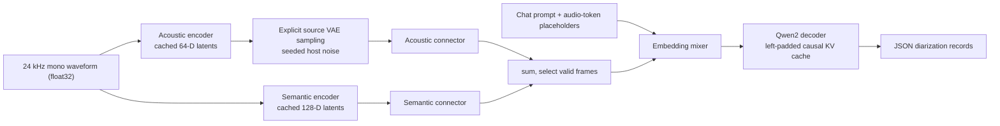

# VibeVoice Offline ASR and Diarization

Mobius supports the original offline ASR checkpoint
[`microsoft/VibeVoice-ASR`](https://huggingface.co/microsoft/VibeVoice-ASR) at
revision `d0c9efdb8d614685062c04425d91e01b6f37d944`. It is selected **only** when
the shared `vibevoice` configuration declares
`VibeVoiceForASRTraining`. VibeVoice TTS remains
`VibeVoiceForConditionalGeneration`; unknown or streaming VibeVoice
architectures fail closed rather than falling through to either implementation.

This is distinct from the streaming-ASR work tracked in #723. It uses the
official offline model's Qwen2 decoder (3584 hidden width, 28 layers, 28 query
heads, 4 KV heads) and its 24 kHz, 3200-sample waveform framing.

## Package and host contract

The package exports five ONNX models:

| Component | Input boundary | Output |
|---|---|---|
| `acoustic_encoder` | `input_values` `(B, 1, samples)` `float32`, `past_conv.*`, `is_final_chunk` `bool[1]` | 64-D `audio_latents`, `present_conv.*` |
| `semantic_encoder` | same waveform, final flag, and independent convolution cache | 128-D `audio_latents`, `present_conv.*` |
| `connectors` | both latent streams, full `padding_mask`, `acoustic_noise_scale`, `acoustic_latent_noise` | flattened `audio_features`, per-item valid lengths |
| `embedding` | Qwen token IDs and flattened audio features | `inputs_embeds` |
| `decoder` | embeddings, normal left-padded attention mask, positions, KV cache | logits and present KV cache |

Audio is split into 1,440,000-sample (60-second) chunks. The host carries each
encoder's `present_conv.*` values into the next chunk, concatenates the
resulting latents, then runs `connectors` once over the full sample mask.
It passes `is_final_chunk=[true]` only on the terminal window. The encoder
performs the original source's right-padding independently at every causal
convolution; hosts must **not** zero-pad the raw terminal waveform.
`VibeVoiceASRHost` and `VibeVoiceASRProcessor` in
`mobius.integrations.vibevoice_asr` define that behavior. The explicit noise
inputs reproduce the source's acoustic sample
`latents + vae_std * randn(B) * randn_like(latents)` while making ONNX runs
deterministic under a host-provided seed.

The checkpoint does not include tokenizer or processor artifacts. Export with
`--runtime onnx-genai` writes `preprocessor_config.json`, including the
24 kHz normalization (`-25 dBFS`, epsilon `1e-6`), chunk/cache procedure,
prompt protocol, and output fields. A compatible text tokenizer must be
provided by the host. Current ONNX Runtime GenAI does not orchestrate these
dual cached audio encoders or the source JSON protocol, so Mobius writes
`inference_metadata.yaml` and `runtime_compatibility.json` as advisory
contracts—not a runnable `genai_config.json` claim.

The source system prompt requests JSON records with `Start time`, `End time`,
`Speaker ID`, and `Content`. It uses one `<|box_start|>` placeholder per
`ceil(samples / 3200)`, enclosed by `<|object_ref_start|>` and
`<|object_ref_end|>`, plus the two-decimal audio duration. These are the
ASR tokenizer's actual values for the semantic speech-start/pad/end roles and
the pad token ID is the embedding stage's `audio_token_id`. `context_info` is
source-provided background information/hotword text in that prompt; there is
no separate algorithmic hotword input. `VibeVoiceASRProcessor.build_input_ids()`
uses the compatible tokenizer's chat template to build that exact layout, and
`parse_diarization()` normalizes source variants into `start_time`, `end_time`,
`speaker_id`, and `text`.

The decoder is ordinary causal Qwen2 with prefix-valid left padding
(`0...0, 1...1`). Consequently, it remains eligible for normal Qwen2 GQA
optimizations; the arbitrary attention-mask limitation of VibeVoice TTS does
not apply.

## Scope and evidence

Microsoft lists the following 51 language codes for this checkpoint:
`en, zh, es, pt, de, ja, ko, fr, ru, id, sv, it, he, nl, pl, no, tr, th, ar,
hu, ca, cs, da, fa, af, hi, fi, et, aa, el, ro, vi, bg, is, sl, sk, lt, sw, uk,
kl, lv, hr, ne, sr, tl, yi, ms, ur, mn, hy, jv`. This records the upstream
support claim, including code-switching; it does not make an independent
quality claim.

The checked checkpoint index has 1,177 tensors: both encoder towers,
connectors, Qwen2 embedding/decoder, and 276 acoustic waveform-decoder
tensors. The latter are training/reconstruction-only for this source path and
are deliberately excluded from the inference package.

L1 builds every stage and cache ABI. L2 loads the exact raw config and index
without weights. L3 compares all five stages against the pinned Transformers ASR source
(`f62dc9bf2c90353b442a56e74391fbb8c689b55e`) using a two-item, two-chunk
batch, seeded latent sampling, flattened replacement, and left-padding. A
separate source-derived terminal-frame test exercises Microsoft's pinned
streaming implementation (`1541f590c7099820f10ea012f48d2399282df69f`):
a raw partial chunk emits its ceiling frame only when the final-chunk flag
causes every causal convolution to pad its own intermediate input. The
processor tests cover normalization, 3200/60-second framing, prompt context,
and JSON parsing.

L4/L5 real-weight transcription and diarization remain unverified because the
official BF16 checkpoint is approximately 8.67B parameters and no suitable
GPU was available. On a provisioned CUDA host, use a BF16 CUDA export and run
the real source-vs-ONNX workflow with the processor contract before treating
transcription or diarization quality as validated.
